# Афиша мероприятий (Meetups)

Небольшое веб-приложение на Flask: организаторы публикуют мероприятия с датой и местом,
пользователи записываются на них и видят список гостей.

## Возможности

- регистрация, вход и выход (Flask-Login), пароли хранятся только в виде хеша с солью;
- создание, редактирование и удаление своих мероприятий (название, описание, дата, место, лимит мест);
- запись на мероприятие и отмена записи, список гостей на странице мероприятия;
- поиск и фильтры на главной (GET-параметры `q`, `location`, `when`);
- страница «Мои события»: где я организатор и куда записан.

## Стек

Python 3, Flask, Jinja2, Flask-SQLAlchemy (SQLite), Flask-Login, werkzeug.security.

## Структура проекта

```
app.py            маршруты и логика (views)
models.py         модели базы данных
seed.py           демо-данные (три мероприятия в Иркутске)
requirements.txt  зависимости
static/style.css  оформление
templates/
  base.html         базовый шаблон: меню, сообщения, блоки title и content
  _event_card.html  строка афиши (подключается через include)
  index.html        афиша с поиском и фильтрами
  event_detail.html мероприятие и список гостей
  event_form.html   создание и редактирование мероприятия
  login.html, register.html, my_events.html, error.html
```

## Модель данных

| Таблица | Назначение | Связи |
|---|---|---|
| `user` | пользователь (он же организатор и участник) | — |
| `profile` | имя и «о себе» | **один к одному** с `user` (`user_id` уникален) |
| `event` | мероприятие | **один ко многим**: организатор (`user`) → его мероприятия |
| `registrations` | запись участника на мероприятие | **многие ко многим**: `user` ↔ `event` |

## Запуск

```
python -m venv venv
venv\Scripts\activate
pip install -r requirements.txt
python app.py
```

Приложение откроется на http://127.0.0.1:5000. База данных (`instance/meetups.db`) создаётся при первом запуске.

### Демо-данные

```
python seed.py
```

Скрипт создаёт организатора `afisha` (пароль случайный, выводится в консоль) и три мероприятия.
Повторный запуск дубликатов не создаёт.

## Безопасность

- пароли хешируются через `generate_password_hash` (scrypt) со случайной солью;
- изменение данных выполняется только запросами POST;
- редактировать и удалять мероприятие может только его организатор (иначе 403);
- шаблоны Jinja2 экранируют пользовательский ввод.

Перед публикацией в интернет замените `SECRET_KEY` в `app.py` на свой случайный ключ.

## Тестирование

Проект проверен вручную в браузере и через консоль Flask. Скриншоты лежат в папке [`tests/`](tests).
Таблицы ниже сгруппированы по требованиям задания.

### 1. Маршрутизация (Flask)

| Что проверяли | Результат и скриншот |
|---|---|
| Все маршруты приложения: `flask --app app routes` | Видны 11 маршрутов и их методы: страницы показываются через GET, данные формы отправляются через POST, а запись, отмена записи, удаление и выход принимают только POST<br><br><a href="tests/post_get.png">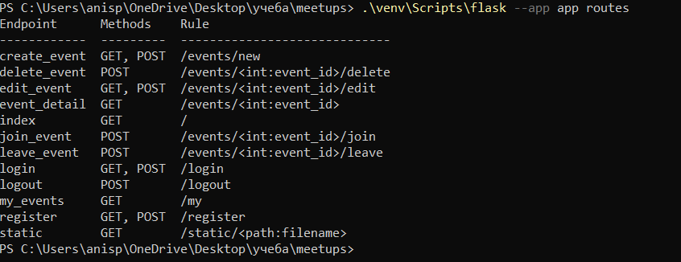</a> |

### 2. База данных (Flask-SQLAlchemy)

| Что проверяли | Результат и скриншот |
|---|---|
| Связь «многие ко многим» в консоли Flask: `Event.attendees`, `User.attending` и строки таблицы `registrations` | У одного события несколько гостей, у одного пользователя несколько событий. В таблице связи хранятся `user_id`, `event_id` и время записи<br><br><a href="tests/many-to-many.png">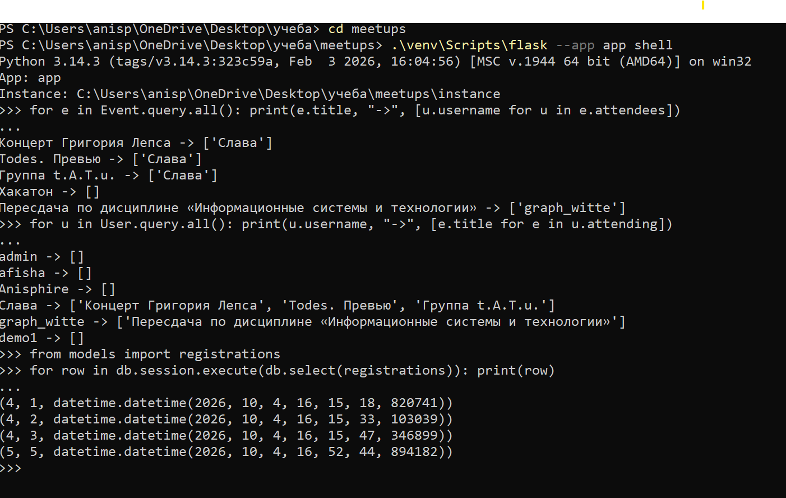</a> |

### 3. Аутентификация и безопасность (Flask-Login)

| Что проверяли | Результат и скриншот |
|---|---|
| Регистрация с паролем из 3 символов | Регистрация не проходит, пароль должен быть не короче 6 символов<br><br><a href="tests/registration_3.png">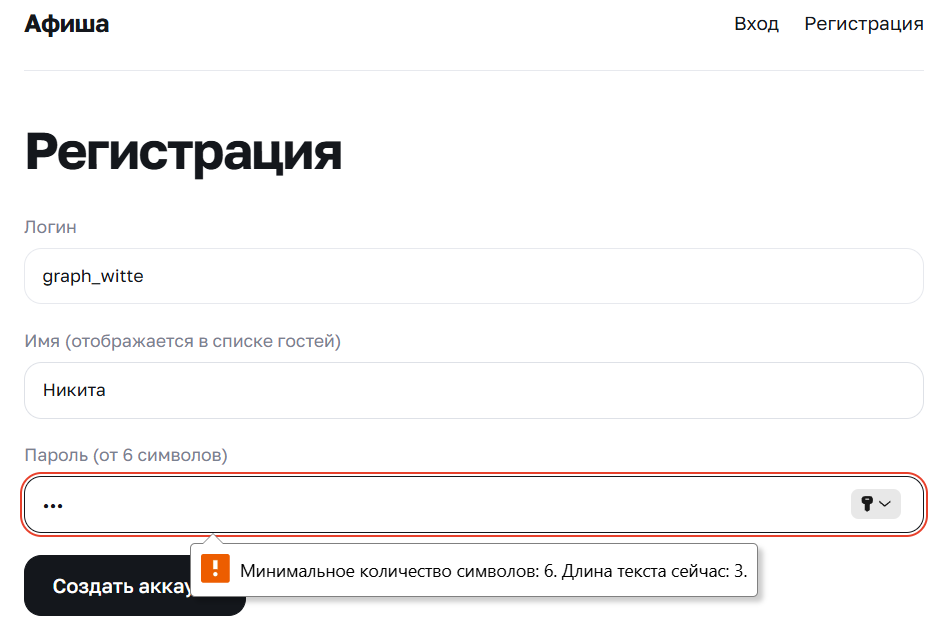</a> |
| Регистрация с нормальным паролем | Пользователь сразу вошёл: сообщение «Добро пожаловать!», его логин и кнопка «Выйти» в меню (`login_user`, `current_user`)<br><br><a href="tests/reg.png">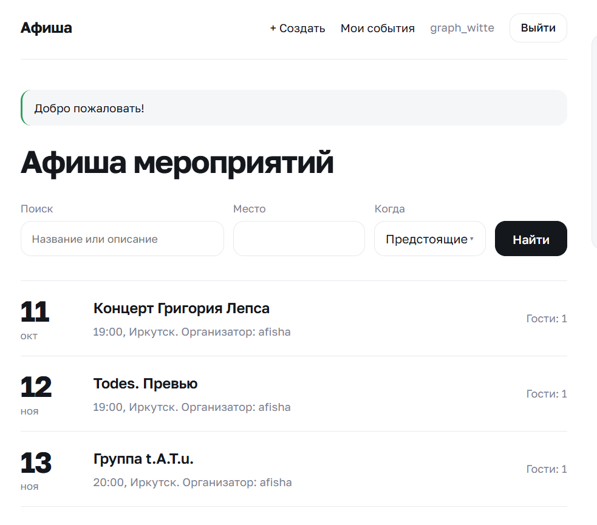</a> |
| Вход с неверным паролем | Сообщение «Неверный логин или пароль.», введённый логин остаётся в поле<br><br><a href="tests/wrong_password.png">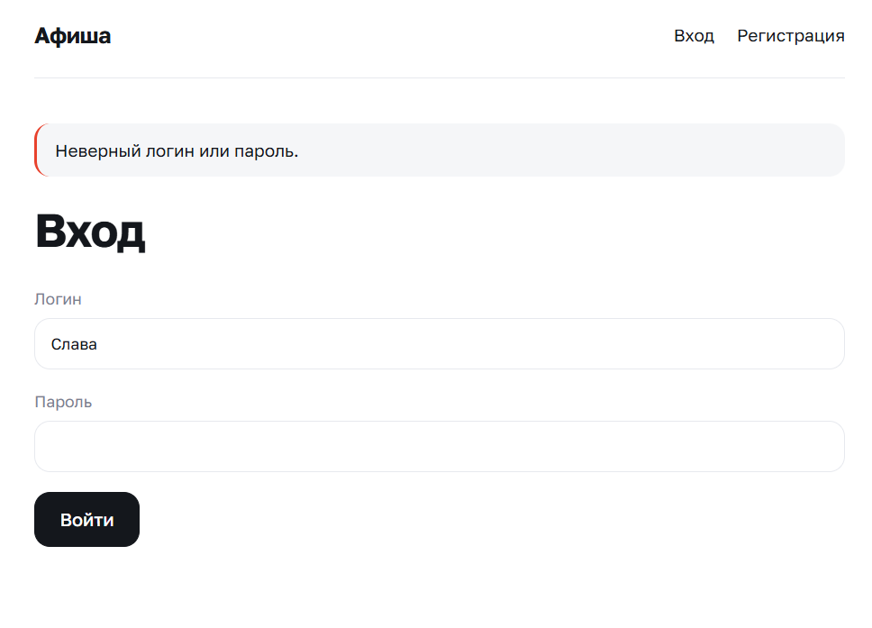</a> |
| Выход из аккаунта | В меню снова «Вход» и «Регистрация» (`logout_user`)<br><br><a href="tests/logout.png">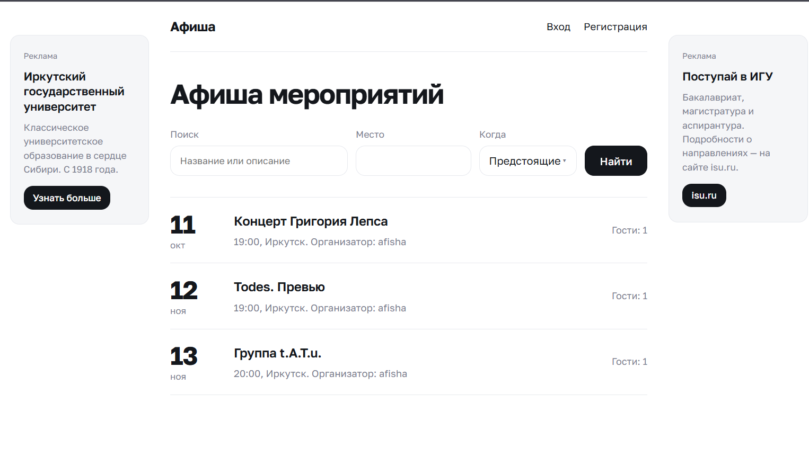</a> |
| Страница события без входа | Вместо записи кнопка «Войти, чтобы записаться»: записаться может только вошедший пользователь (`@login_required`)<br><br><a href="tests/login_require.png">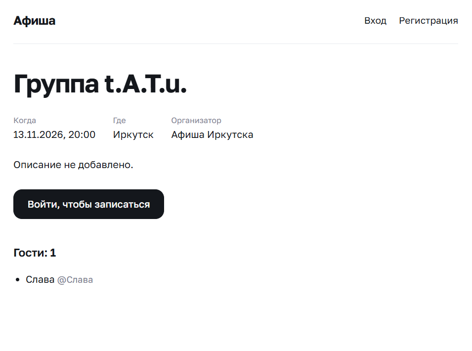</a> |
| Открыть адрес редактирования чужого события | Страница «Доступ запрещён.» (ошибка 403): редактировать может только организатор<br><br><a href="tests/edit_disebled.png">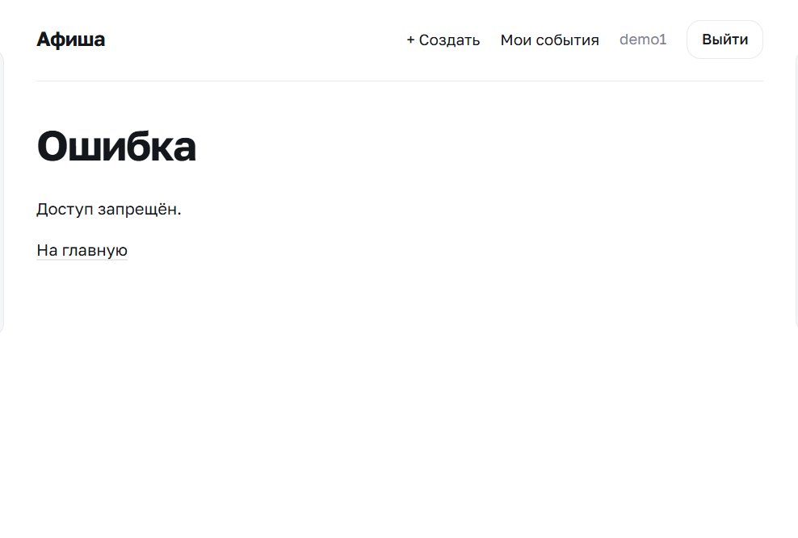</a> |
| Хранение паролей: вывод `password_hash` в консоли Flask | Пароли хранятся только как хеш `scrypt:…$соль$хеш`, у каждого пользователя своя соль, самих паролей в базе нет<br><br><a href="tests/salt.png">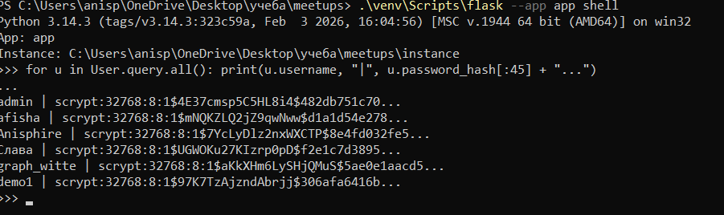</a> |

### 4. Работа с данными (формы и поиск)

| Что проверяли | Результат и скриншот |
|---|---|
| Создание события, вкладка Network в браузере | Форма отправляется запросом `POST /events/new`, сервер отвечает `302 FOUND` и открывает страницу созданного события с сообщением «Мероприятие создано.»<br><br><a href="tests/create_event.png">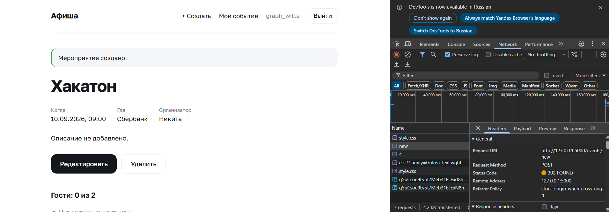</a> |
| Поля формы создания, вкладка Payload | Сервер получает `title`, `description`, `date`, `location`, `capacity` (`request.form`)<br><br><a href="tests/create_event2.png">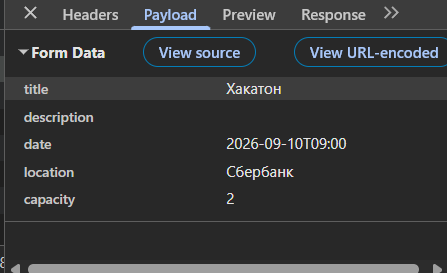</a> |
| Поиск «лепс» (строчными буквами) | Найдено одно событие «Концерт Григория Лепса» (GET-параметр `q`)<br><br><a href="tests/requiest.png">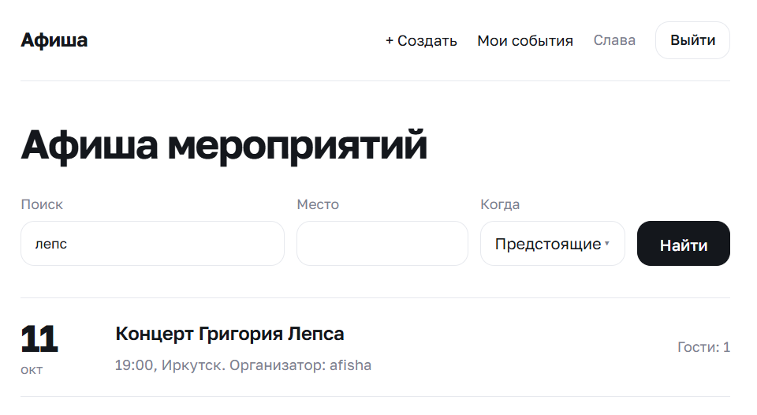</a> |
| Поиск слова, которого нет в афише | Сообщение «Ничего не найдено.»<br><br><a href="tests/plumbus.png">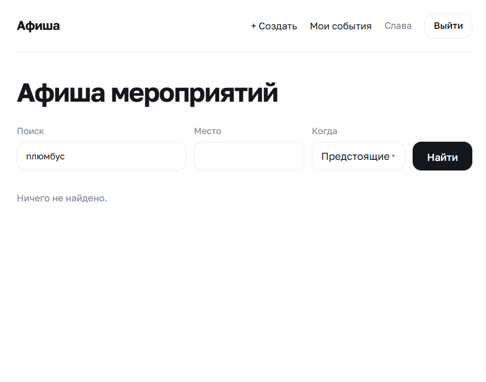</a> |
| Фильтр по месту «Иркутск» и периоду «Все» | Показаны все три иркутских события (GET-параметры `location` и `when`)<br><br><a href="tests/filter_location.png">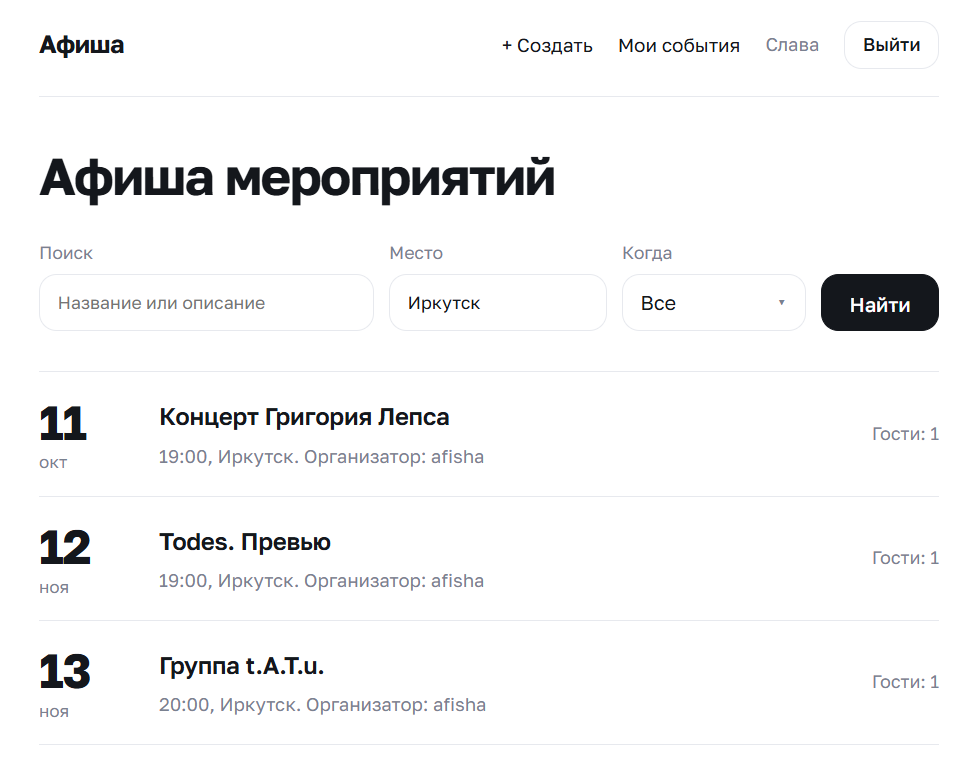</a> |
| Фильтр «Прошедшие» | В списке только событие, дата которого уже прошла<br><br><a href="tests/create_event3.png">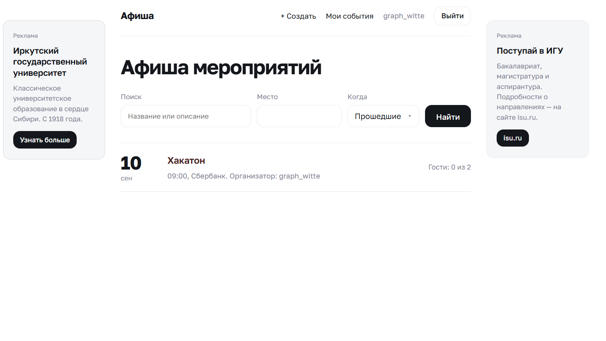</a> |

### Основная функциональность по теме

| Что проверяли | Результат и скриншот |
|---|---|
| Создание события с датой и местом | Событие создано и открылось на своей странице: дата, место, организатор<br><br><a href="tests/create_event.png"></a> |
| Запись участников, список гостей и лимит мест | Для события с лимитом 2 показано «Гости: 2 из 2», перечислены оба гостя, вместо записи надпись «Свободных мест нет.»<br><br><a href="tests/fullevent.png">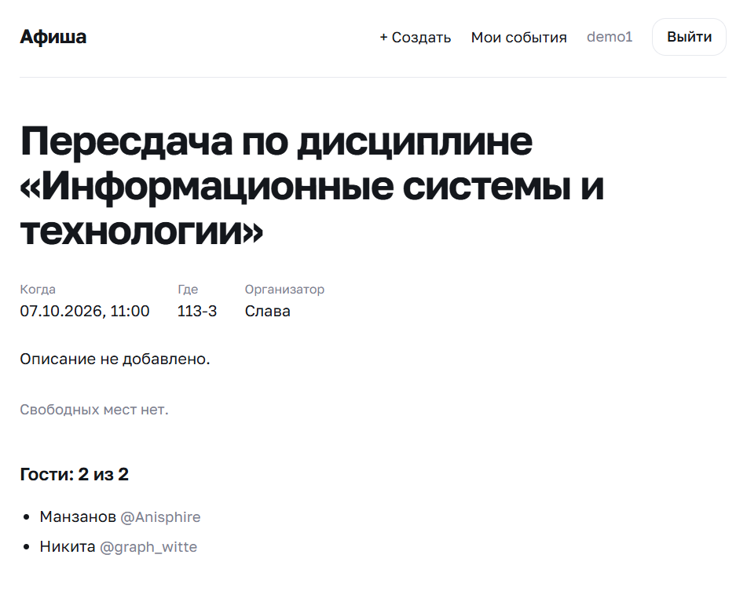</a> |
| Страница «Мои события» | Два раздела: «Я организатор» и «Я участвую» (событие, на которое записан пользователь)<br><br><a href="tests/my_events.png">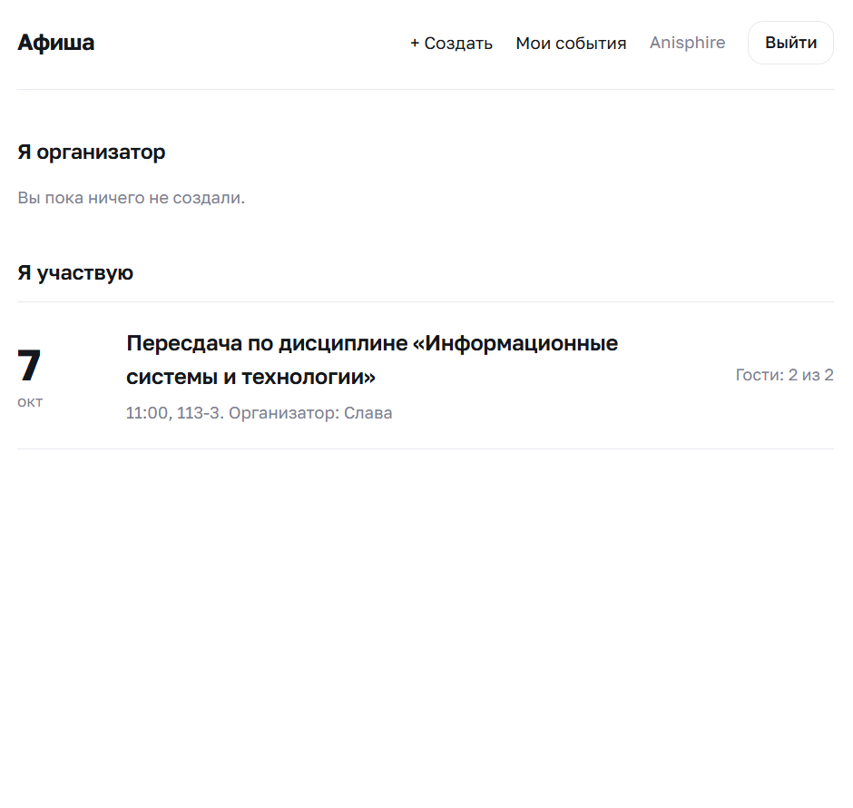</a> |

### Как повторить проверку

В папке проекта, при активированном `venv` и установленных зависимостях:

```
flask --app app routes
flask --app app shell
```
